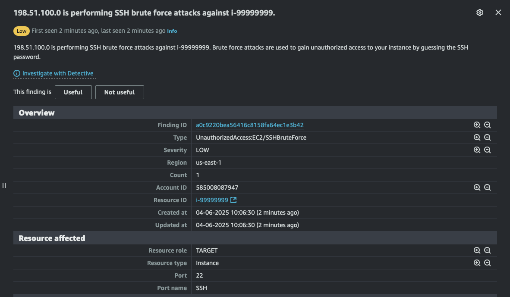
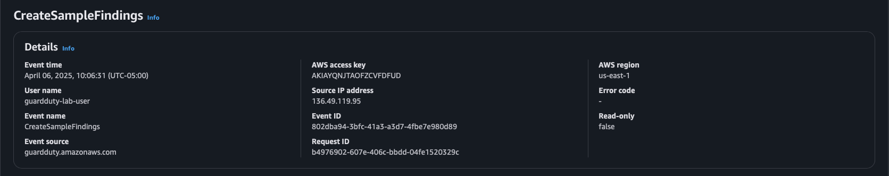
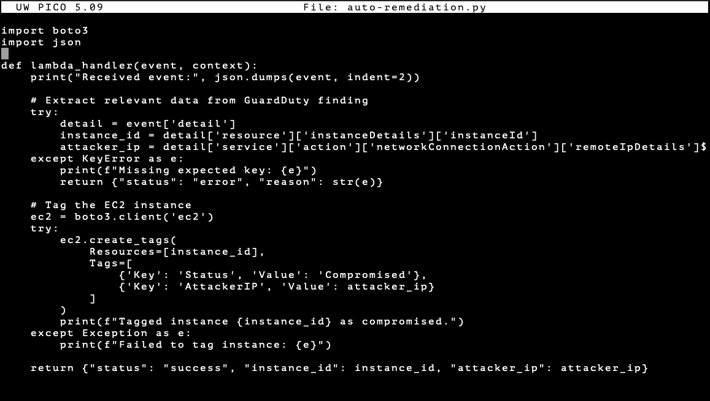

# 🛡️ AWS Threat Detection Lab

### 🛡️ AWS Security Services
[](https://aws.amazon.com/security/)
*Made using Amazon Web Services*

This project simulates real-world threat detection and incident response in AWS using **GuardDuty**, **CloudTrail**, **Security Hub**, and **Lambda**.

It showcases hands-on skills in cloud-native monitoring, threat tracing, and auto-remediation — fully documented with supporting screenshots and CLI examples.

---

## 🎯 What You'll Learn

- Detect suspicious activity with **Amazon GuardDuty**
- Trace root cause using **CloudTrail logs**
- Centralize and prioritize alerts using **AWS Security Hub**
- Automatically respond to threats with **Lambda** and **EventBridge**
- Simulate IAM/network misuse to trigger alerts
- Document your findings, troubleshooting, and remediation steps

---

## 🧪 Simulated Threats

- SSH Brute-force attempts on EC2
- EC2 port scanning activity
- IAM key use from an unapproved location
- Logins from known Tor exit nodes

---

## 🧱 Architecture Components

This lab demonstrates a basic security operations pipeline using:

- **GuardDuty** to detect threats like port scans and brute-force login attempts  
- **CloudTrail** to log and analyze API calls triggering alerts  
- **Security Hub** to aggregate and score findings from GuardDuty and AWS Config  
- **Lambda** for automatic remediation of specific threat types  
- **EventBridge** to detect specific GuardDuty alerts and invoke response actions  

---

## 🧪 Screenshots of the Lab in Action

### 🔐 GuardDuty Detection
 
*A simulated SSH brute-force attack was detected by GuardDuty*

### 📜 CloudTrail Log Analysis
  
*API activity logged in CloudTrail, showing exact call made*

### 🧭 Security Hub Summary Dashboard
  
*Aggregated findings including simulated GuardDuty threat*

### ⚡ Lambda Auto-Remediation
  
*Python Lambda function used to respond to threats*

---

## 📁 Folder Structure

```
AWS-GuardDuty-Security-Monitoring-Lab/
├── README.md
├── cloudformation/
│   └── guardduty-setup.yaml
├── lambda/
│   ├── auto-remediation.py
│   └── auto-remediation.zip
├── docs/
│   ├── guardduty-setup-notes.md
│   ├── simulate-malicious-ip-activity.md
│   ├── cloudtrail-log-analysis.md
│   ├── security-hub-dashboard-guide.md
│   └── auto-remediation.md
├── screenshots/
│   └── [All screenshots referenced in the docs]
```

---

## 🚀 How to Run the Lab

1. **Enable GuardDuty** in your account (free tier includes 30 days of extended detection)
2. Enable **S3 Protection, EC2 Malware Protection**, and others as needed
3. Simulate threats using `aws guardduty create-sample-findings`
4. View the alert in GuardDuty and validate the detection
5. Trace the source in **CloudTrail logs**
6. View the finding ingested into **Security Hub**
7. Trigger a **Lambda function via EventBridge** to auto-remediate

---

## 📓 Mini Playbook: SSH Brute-Force Auto-Remediation

**Scenario:** GuardDuty detects a brute-force SSH attack (`UnauthorizedAccess:EC2/SSHBruteForce`) on an EC2 instance.

**Steps Taken:**

1. Created a custom **Lambda function** (`auto-remediation.py`) that:
   - Parses the GuardDuty finding
   - Identifies the target EC2 instance
   - Automatically applies a restrictive security group to block further access

2. Created an **EventBridge rule** to listen for this specific finding type.

3. Validated the Lambda was triggered successfully using CloudWatch logs.

**Outcome:**
> EC2 instance targeted by a simulated attack was **automatically isolated** within seconds of detection.

---

## 💾 Notes

- Each detection, simulation, and remediation is documented in `/docs/`
- Screenshots for each step are stored in `/screenshots/`
- All code (Lambda, CLI commands) is version-controlled
- IAM setup follows least-privilege and group-based policies

---

## 🧠 Interview Tip

> “This lab demonstrates how to simulate threats, detect them with GuardDuty, trace the source with CloudTrail, and automatically remediate them with Lambda — all using cloud-native tools.”

---
Log entry for 2025-08-02
Log entry for 2025-08-03
Log entry for 2025-08-04
Log entry for 2025-08-06
Log entry for 2025-08-07
Log entry for 2025-08-08
Log entry for 2025-08-09
Log entry for 2025-08-10
Log entry for 2025-08-11
Log entry for 2025-08-12
