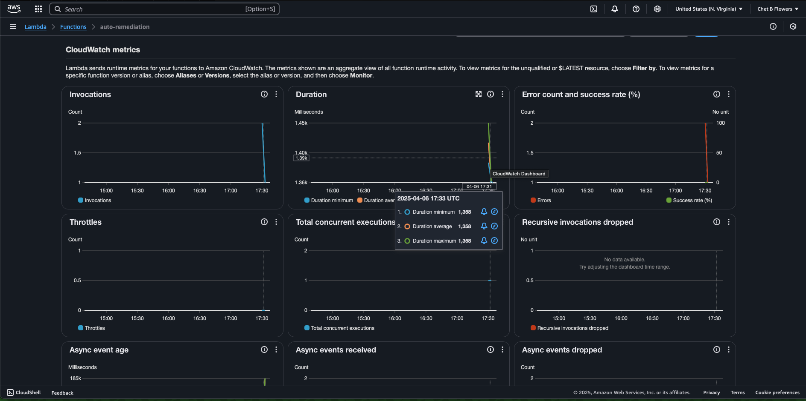
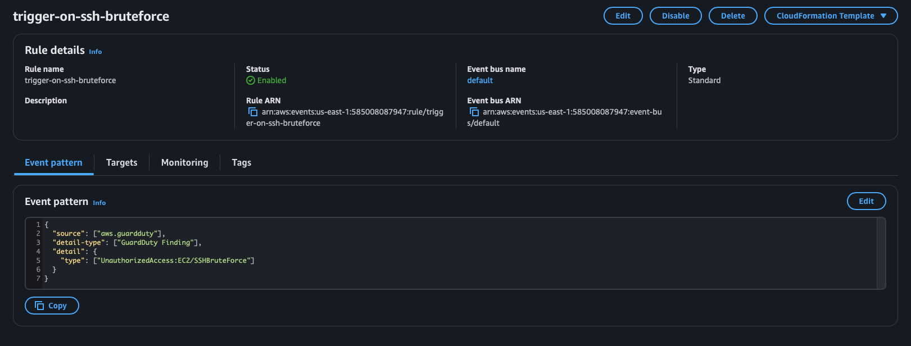
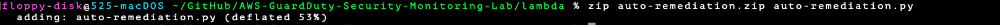

# ⚙️ Auto-Remediation: GuardDuty ➝ EventBridge ➝ Lambda

## 🚨 What This Automation Does

When **Amazon GuardDuty** detects an SSH brute-force attack, this setup **automatically triggers a Lambda function** to respond. It simulates how real-time security systems can react instantly to unauthorized behavior.

---

## 🛠️ How It Works

1. **GuardDuty** generates a finding for `UnauthorizedAccess:EC2/SSHBruteForce`
2. **EventBridge** matches that finding using a custom event pattern
3. **Lambda** is invoked automatically
4. **Lambda** adds a security tag (`Status: Compromised`) to the simulated EC2 instance

---

## 🔁 Test Trigger

**CLI Command Used to Simulate the Attack:**

```bash
aws guardduty create-sample-findings \
  --detector-id $(aws guardduty list-detectors --query 'DetectorIds[0]' --output text) \
  --finding-types UnauthorizedAccess:EC2/SSHBruteForce \
  --region us-east-1
```

---

## 📸 Screenshots: Automation Pipeline

  
*Lambda function shows successful invocations triggered by the EventBridge rule.*

  
*EventBridge rule targeting the auto-remediation Lambda function.*

  
*Zip file successfully uploaded to AWS Lambda.*

  
*CLI command used to create the deployment package.*

---

## 🧠 Why This Matters

This auto-remediation setup mimics real-world response mechanisms that prevent unauthorized access from escalating. Security engineers and cloud defenders use this pattern to:

- Contain threats automatically
- Save time on manual triage
- Reduce dwell time and attacker impact

---

## ✅ Final Thoughts

This marks the **end of the detection-to-remediation pipeline**. GuardDuty spotted the threat, and Lambda jumped into action — just like it should in a production-grade cloud defense environment.
