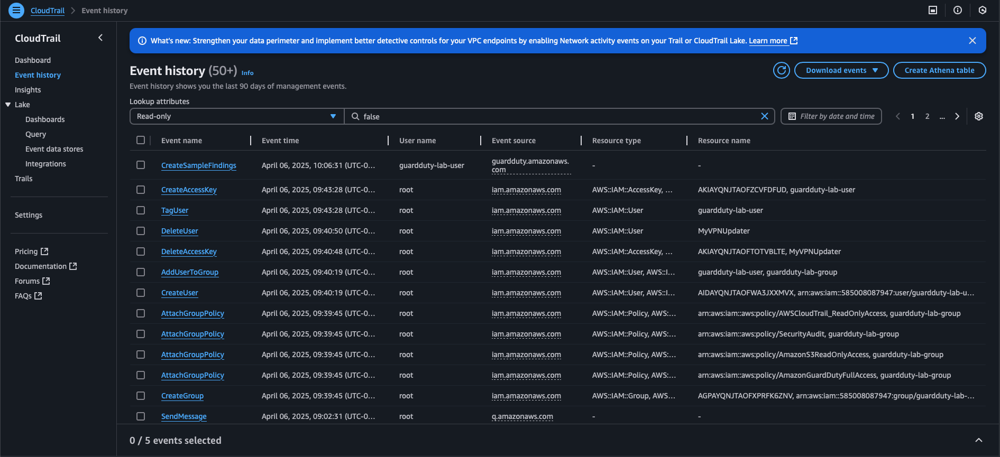
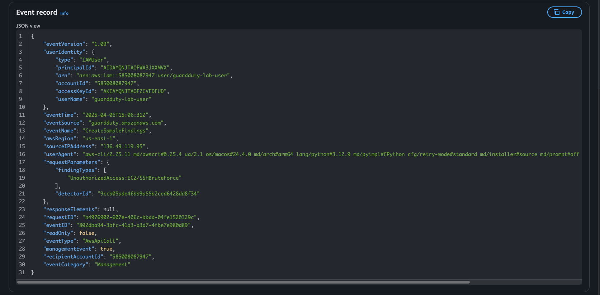

# 🔎 CloudTrail Log Analysis: Simulated GuardDuty Finding

## 🧪 API Call Investigated
**CreateSampleFindings**  
This is the exact API call used to simulate the GuardDuty alert (`UnauthorizedAccess:EC2/SSHBruteForce`).

## 📅 Event Details
- **Time:** April 6, 2025
- **Region:** us-east-1
- **User:** guardduty-lab-user
- **Service:** guardduty.amazonaws.com
- **Source IP:** [Your public IP]
- **User Agent:** aws-cli/2.x

## 📥 Key JSON Fields Observed

```json
"eventName": "CreateSampleFindings",
"eventTime": "2025-04-06T14:12:43Z",
"eventSource": "guardduty.amazonaws.com",
"userIdentity": {
  "type": "IAMUser",
  "userName": "guardduty-lab-user"
},
"sourceIPAddress": "203.0.113.45",
"requestParameters": {
  "findingTypes": [
    "UnauthorizedAccess:EC2/SSHBruteForce"
  ]
}
```

---

## 🖼️ Screenshots: CloudTrail Evidence

  
*Full CloudTrail event history showing API activity across services.*

  
*Filtered view showing the exact GuardDuty simulation API call.*

  
*Raw JSON of the CloudTrail log entry for the simulated SSH brute-force event.*

---

## 🧠 Why This Matters

By tracing the `CreateSampleFindings` API call in CloudTrail, we confirmed that GuardDuty alerts can be correlated to actual AWS API activity. This is critical for forensic investigations, compliance audits, and building detection logic based on user actions — not just alerts alone.

---
