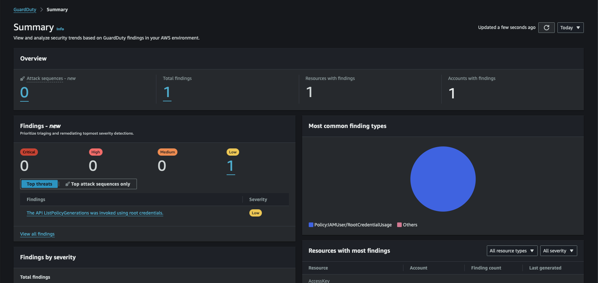
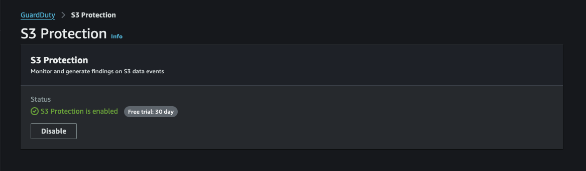
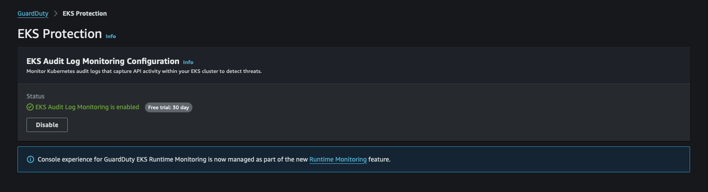
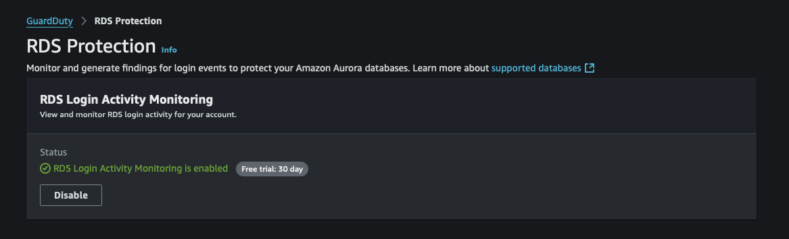
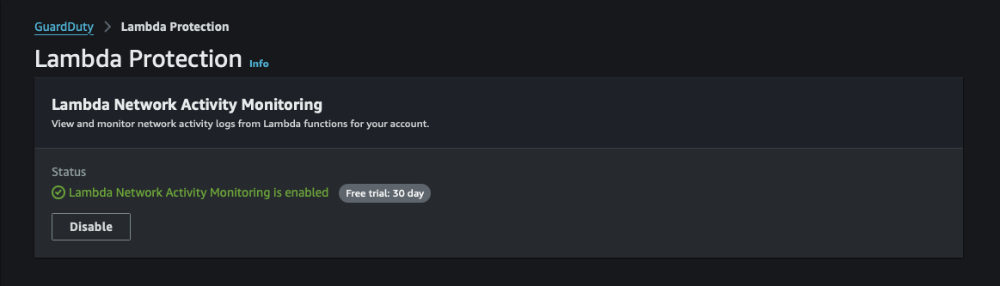
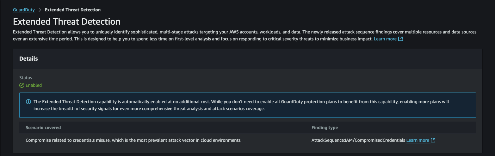
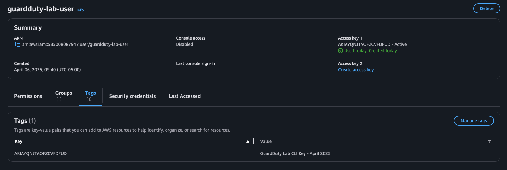
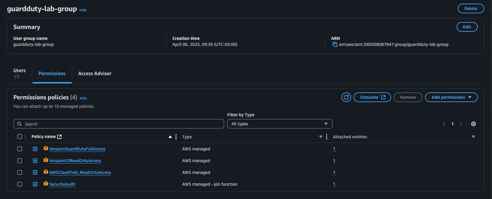

# GuardDuty Setup Notes

## ✅ Enabled GuardDuty in Region: us-east-1
- S3 protection: ✅
- Malware protection: ✅
- EKS protection: ❌ (not using it right now)

Date: April 6, 2025

## 🔐 Protection Plans Enabled

As part of AWS's 30-day free trial, the following advanced detection features were enabled:

- ✅ S3 Protection
- ✅ Malware Protection for EC2
- ✅ EKS Audit Log Monitoring
- ✅ RDS Login Activity Monitoring
- ✅ Lambda Network Activity Monitoring
- ✅ Unlimited Threat Detection

These layers enhance the lab's realism and demonstrate extended GuardDuty capabilities beyond baseline detection.

## 🖼️ Screenshots: GuardDuty Setup & Protections

  
*GuardDuty successfully enabled in us-east-1*

  
*S3 data event protection enabled*

  
*Malware protection for EC2 instances*

  
*Audit log monitoring for Kubernetes (EKS)*

  
*RDS login activity monitoring enabled*

  
*Lambda network activity monitoring enabled*

  
*Advanced threat detection features enabled*

  
*IAM user with programmatic access for lab*

  
*GuardDuty permissions assigned via group*
