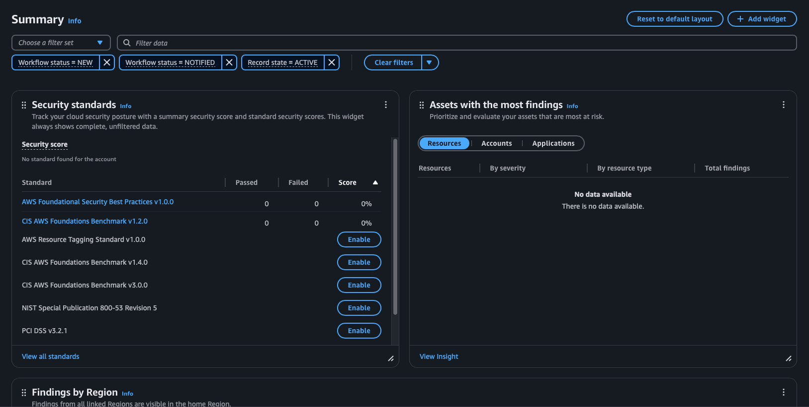
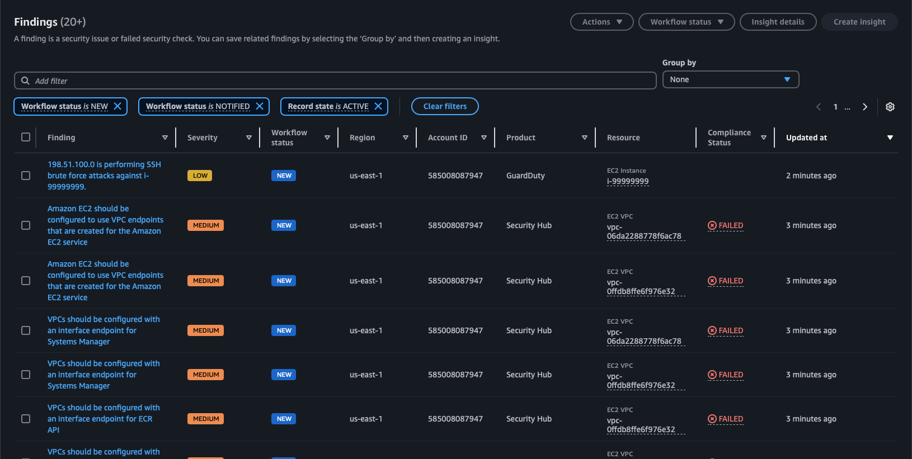

# 🛡️ Security Hub Integration & Findings Overview

## ✅ Enabled On: April 6, 2025

### 🔍 Why Security Hub Matters

AWS Security Hub gives you a **single pane of glass** for all your security findings across AWS services. It aggregates alerts from:
- Amazon GuardDuty
- AWS Config
- AWS Inspector
- IAM Access Analyzer
- Macie
...and more.

Security Hub evaluates your environment against **industry best practices** (CIS, NIST, AWS FSBP), assigns severity scores, and helps centralize detection for triage and automation.

---

## 🔄 How Findings Flowed In

After enabling Security Hub:
1. I re-simulated an **SSH brute-force attack** using the GuardDuty `create-sample-findings` CLI.
2. GuardDuty detected the activity and generated a finding.
3. Security Hub **automatically ingested** the finding as a LOW severity `UnauthorizedAccess:EC2/SSHBruteForce` event.
4. The finding appeared in the Security Hub “Findings” tab, grouped by source = `GuardDuty`.

This proves that **GuardDuty is integrated and working as a threat feed**, and that Security Hub is actively ingesting and tracking activity.

---

## 🧪 Simulated Finding Details

- **Threat Type:** `UnauthorizedAccess:EC2/SSHBruteForce`
- **Product Source:** GuardDuty
- **Target Resource:** EC2 Instance `i-99999999`
- **Severity:** LOW
- **Status:** Active
- **Region:** us-east-1

🧠 *This simulates a real-world brute-force attempt where an attacker tries to gain access to an EC2 server by guessing login credentials over SSH (port 22).*

---

## 🖼️ Screenshots

### 1. Security Hub Dashboard

  
*Overview after enabling Security Hub and integrations*

### 2. Finding Ingested from GuardDuty

  
*Simulated SSH brute-force attack appearing in Security Hub*

---

## 🧠 Interview Tip

> “I used GuardDuty’s CLI to simulate a common external attack (SSH brute-force) and confirmed that the threat was detected and forwarded to Security Hub. This validated my integration pipeline and showed how AWS-native tools can monitor, ingest, and score potential security threats in real time.”

---
